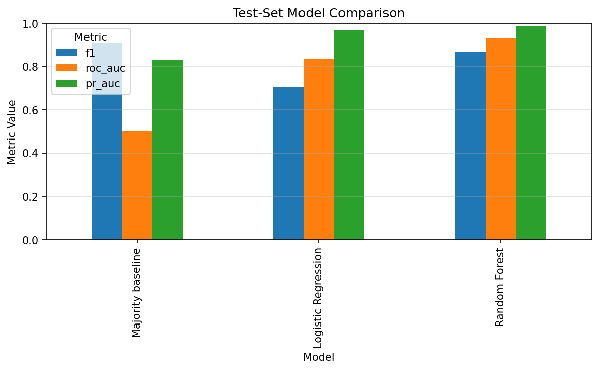
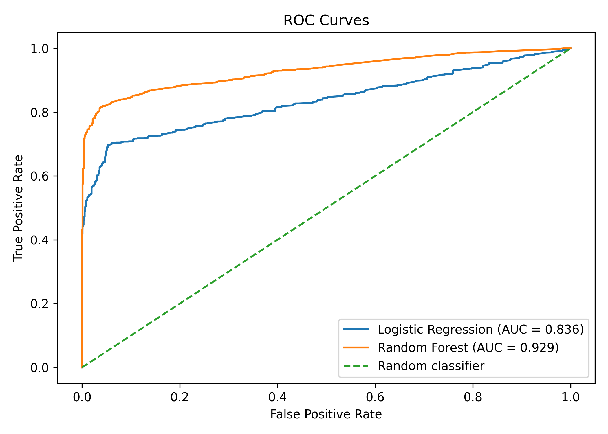
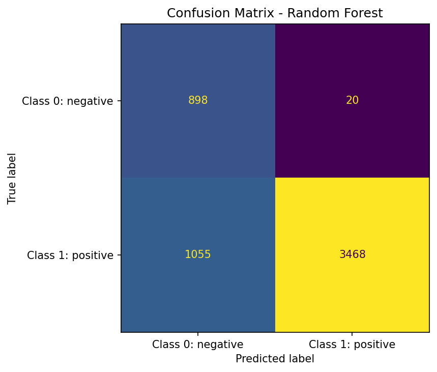
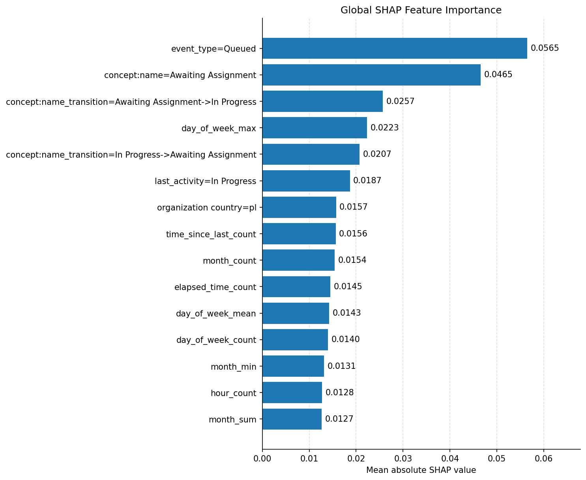
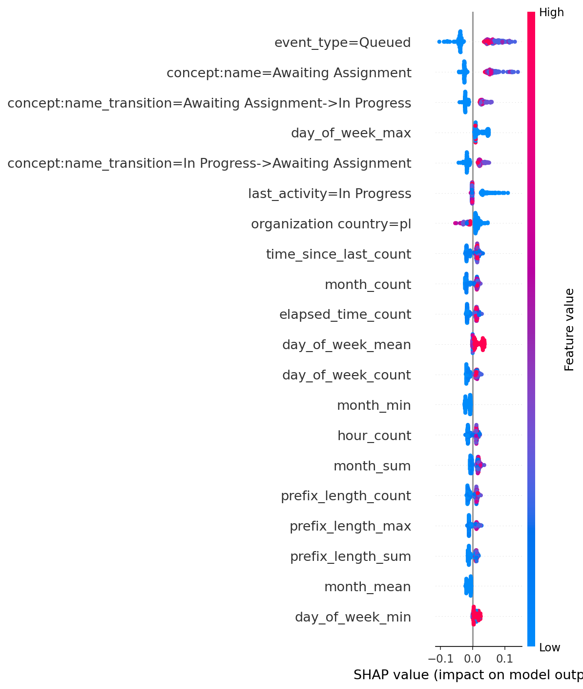
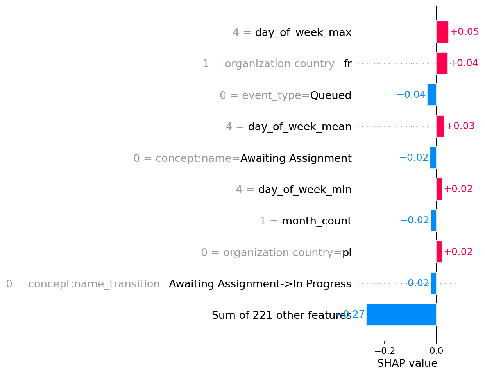

# Assessment Document: Explainable Outcome Prediction for Process Event Logs

**Project:** Explainable Process Prediction  
**Course:** Supervised Process Intelligence Praktikum, SS 2026  
**Track:** BSc Project 2 — Explainability  
**Dataset:** BPI Challenge 2013 Incidents  
**Team:** Oleksandr Smuhliakov, Sofia Vishnevskaia, Benedikt Koop  

## Table of Contents

1. [Project Goal and Prediction Task](#1-project-goal-and-prediction-task)
2. [Data and Labels](#2-data-and-labels)
3. [Implementation Summary](#3-implementation-summary)
4. [Experimental Design](#4-experimental-design)
5. [Results](#5-results)
   - [5.1 Model Comparison on the Test Set](#51-model-comparison-on-the-test-set)
   - [5.2 Confusion Matrix Interpretation](#52-confusion-matrix-interpretation)
   - [5.3 Explainability Results](#53-explainability-results)
   - [5.4 Comparison with the Interpretable Model](#54-comparison-with-the-interpretable-model)
6. [Testing Evidence](#6-testing-evidence)
7. [Reproducibility and Usability](#7-reproducibility-and-usability)
8. [Critical Evaluation](#8-critical-evaluation)
9. [Project Retrospective](#9-project-retrospective)

## 1. Project Goal and Prediction Task

The project implements an explainable outcome prediction pipeline for process event logs. The goal is to predict the final outcome of an incident case from prefix-level event-log data and to explain the prediction using SHAP.

The main project question is:

**Can we predict the outcome of an incident case and explain the prediction in an understandable way?**

The task is binary classification. A case is labelled as positive if its final lifecycle transition is `Closed` or `Resolved`. All other final lifecycle transitions are labelled as negative.

The project focuses on prefix-level prediction. One row in the supervised dataset represents one prefix of a case. For example, a prefix of length 3 contains only the first three events of the case. The label is still the final outcome of the complete case, but the features only use information available up to the current prefix.

This setting simulates prediction for running cases. Therefore, the model must not use information from future events or from the final state of the case.

The implemented models are:

| Model | Role |
|---|---|
| Majority baseline | Simple reference model |
| Logistic Regression | Interpretable model |
| Random Forest | Black-box model used for SHAP explanations |

## 2. Data and Labels

The project uses the BPI Challenge 2013 incident-management event log. The log contains incident cases from an IT service-management process. Each event belongs to one incident case and contains an activity, lifecycle transition, timestamp, and additional attributes.

The main columns used by the pipeline are:

| Role | Column |
|---|---|
| Case identifier | `case:concept:name` |
| Original activity | `concept:name` |
| Lifecycle transition | `lifecycle:transition` |
| Timestamp | `time:timestamp` |
| Additional attributes | Resource, organization, country, product, and other available event attributes |

Before modelling, events are sorted by case and timestamp.

The full raw event log contains:

| Property | Value |
|---|---:|
| Cases | 7,554 |
| Events | 65,533 |
| Original activity types | 4 |
| Lifecycle states | 13 |
| Time span | 2010-03-31 to 2012-05-23 |
| Average case length | 8.68 events |
| Median case length | 6 events |
| Maximum case length | 123 events |
| 90th percentile case length | 17 events |

The final lifecycle transitions are distributed as follows:

| Final lifecycle transition | Cases |
|---|---:|
| Closed | 5,573 |
| Resolved | 90 |
| In Call | 1,882 |
| Wait - User | 3 |
| Wait - Implementation | 2 |
| In Progress | 2 |
| Cancelled | 1 |
| Assigned | 1 |

The binary outcome is defined as:

| Class | Meaning | Cases |
|---|---|---:|
| 1 | Positive outcome: final transition is `Closed` or `Resolved` | 5,663 |
| 0 | Other final outcome | 1,891 |

The positive class is the majority class. This is important for interpreting the results because a majority baseline already performs well on accuracy and class-1 F1-score.

## 3. Implementation Summary

The implementation is organized as a reusable Python pipeline. The core logic is placed in `src/`, while notebooks are used for exploration and final demonstration.

The main modules are:

| Module | Purpose |
|---|---|
| `src/data_extraction/extract.py` | Load and split the event log |
| `src/feature_engineering/outcome_labelling.py` | Create binary outcome labels |
| `src/feature_engineering/prefix_generation.py` | Generate case prefixes |
| `src/feature_engineering/feature_encoding.py` | Encode prefixes into feature matrices |
| `src/modeling/baseline.py` | Train the majority baseline |
| `src/modeling/models.py` | Train Logistic Regression and Random Forest models |
| `src/modeling/model_selection.py` | Select Random Forest hyperparameters |
| `src/modeling/evaluation.py` | Compute metrics and create evaluation plots |
| `src/pipeline/training_pipeline.py` | Run the training workflow |
| `src/pipeline/evaluation_pipeline.py` | Run final evaluation and save outputs |
| `src/explainability/shap_explainer.py` | Generate global and local SHAP explanations |
| `src/prototype/predict_explain.py` | Demonstrate prediction and explanation for one case |

The full pipeline can be executed with:

```bash
python scripts/run_pipeline.py \
  --data data/raw/BPI_Challenge_2013_incidents/BPI_Challenge_2013_incidents.xes \
  --output-dir outputs
```

The pipeline writes generated reports and figures to:

```text
outputs/reports/
outputs/figures/
```

These generated outputs are not treated as source code. The assessment document includes the relevant tables directly, and selected figures are copied to:

```text
docs/figures/
```

The most important generated files are:

| File | Purpose |
|---|---|
| `outputs/reports/test_model_comparison.csv` | Final test-set metrics |
| `outputs/reports/validation_model_comparison.csv` | Validation metrics |
| `outputs/reports/random_forest_validation_results.csv` | Random Forest model-selection results |
| `outputs/reports/test_predictions.csv` | Prediction output for the test set |
| `outputs/reports/shap_feature_importance.csv` | Global SHAP feature importance |
| `outputs/reports/local_explanation_cases.csv` | Selected local explanation cases |
| `outputs/figures/` | Evaluation and SHAP plots |

The project also includes a prototype function in:

```text
src/prototype/predict_explain.py
```

The prototype takes one encoded case or prefix and returns the predicted class, the predicted probability, and the most important local SHAP contributors. It is not a graphical application. Its purpose is to show that the trained model and explanation logic can be applied to an individual input example.

## 4. Experimental Design

The original cases are split into training, validation, and test sets using a temporal split. The split is performed before prefix generation. This avoids leakage because prefixes from the same case cannot appear in different splits.

The split uses the following proportions:

| Split | Share | Purpose |
|---|---:|---|
| Training | 70% | Fit preprocessing and models |
| Validation | 15% | Select Random Forest hyperparameters |
| Test | 15% | Final evaluation |

The resulting split sizes are:

| Split | Original cases | Prefix rows |
|---|---:|---:|
| Training | 5,287 | 46,644 |
| Validation | 1,133 | 5,894 |
| Test | 1,134 | 5,441 |

The class distribution by original case is:

| Split | Positive cases | Negative cases |
|---|---:|---:|
| Training | 4,248 | 1,039 |
| Validation | 722 | 411 |
| Test | 693 | 441 |

Prefixes are generated with a minimum prefix length of 1. The full trace is not included as a prefix. This avoids using the complete case as if it were a running case.

The feature matrix includes static, process, and temporal information. Examples include event types, lifecycle transitions, last activity, activity transitions, prefix length, elapsed time, month, hour, day of week, organization country, and resource country.

To reduce leakage risk, features containing the keywords `case_duration` and `relative_age` are removed before model training.

Random Forest hyperparameters were selected on the validation set. The tested configurations were:

| Parameters | Validation accuracy | Validation F1 | Validation ROC-AUC |
|---|---:|---:|---:|
| `n_estimators=100`, `max_depth=5` | 0.792 | 0.862 | 0.932 |
| `n_estimators=100`, `max_depth=10` | 0.807 | 0.873 | 0.938 |
| `n_estimators=200`, `max_depth=5` | 0.791 | 0.861 | 0.933 |

The selected Random Forest configuration was:

```text
n_estimators = 100
max_depth = 10
```

It was selected because it achieved the best validation F1-score among the tested configurations.

The final evaluation uses accuracy, precision, recall, F1-score, ROC-AUC, and PR-AUC. Since the positive class is the majority class, ROC-AUC and PR-AUC are especially useful for comparing the ranking quality of the models.

## 5. Results

### 5.1 Model Comparison on the Test Set

The final test results are:

| Model | Accuracy | Precision class 1 | Recall class 1 | F1 class 1 | ROC-AUC | PR-AUC |
|---|---:|---:|---:|---:|---:|---:|
| Majority baseline | 0.831 | 0.831 | 1.000 | 0.908 | 0.500 | 0.831 |
| Logistic Regression | 0.618 | 0.993 | 0.545 | 0.703 | 0.836 | 0.966 |
| Random Forest | 0.802 | 0.994 | 0.767 | 0.866 | 0.929 | 0.986 |

Class 1 represents the positive outcome, meaning that the final lifecycle transition is `Closed` or `Resolved`. Since this is the majority class, the majority baseline obtains high accuracy and high class-1 F1-score by always predicting class 1.

The Random Forest has the best ROC-AUC and PR-AUC. This means that it ranks cases better than the baseline and Logistic Regression. However, its class-1 F1-score is lower than the majority baseline because the baseline benefits from the class imbalance. Therefore, accuracy and class-1 F1-score alone are not sufficient to evaluate the model.

The Logistic Regression model has high precision but low recall for class 1. This means that when it predicts class 1, it is usually correct, but it misses many class-1 prefixes.





### 5.2 Confusion Matrix Interpretation

The Random Forest confusion matrix on the test prefixes is:

|  | Predicted 0 | Predicted 1 |
|---|---:|---:|
| Actual 0 | 898 | 20 |
| Actual 1 | 1,055 | 3,468 |

The Random Forest detects most class-0 prefixes: 898 out of 918 actual class-0 prefixes are predicted correctly. However, it also predicts class 0 for 1,055 prefixes that actually belong to class 1.

This means that the model is sensitive to patterns associated with non-`Closed` and non-`Resolved` outcomes, but it also produces many false alarms. In a real incident-management setting, this behaviour would require threshold tuning. If missing a problematic case is more costly than checking a false alarm, this may still be useful. If false alarms are expensive, the threshold should be adjusted.



### 5.3 Explainability Results

SHAP was used to explain the final Random Forest model. The global SHAP feature importance table shows that the most influential features are:

| Rank | Feature | Mean absolute SHAP value |
|---:|---|---:|
| 1 | `event_type=Queued` | 0.056 |
| 2 | `concept:name=Awaiting Assignment` | 0.047 |
| 3 | `concept:name_transition=Awaiting Assignment->In Progress` | 0.026 |
| 4 | `day_of_week_max` | 0.022 |
| 5 | `concept:name_transition=In Progress->Awaiting Assignment` | 0.021 |
| 6 | `last_activity=In Progress` | 0.019 |
| 7 | `organization country=pl` | 0.016 |
| 8 | `time_since_last_count` | 0.016 |
| 9 | `month_count` | 0.015 |
| 10 | `elapsed_time_count` | 0.014 |

The most important features mostly describe queueing, assignment, transitions between assignment and progress, and temporal context. This is plausible for an incident-management process because waiting, assignment, and reassignment patterns are related to how incidents move through support teams.





Local SHAP explanations were generated for three selected examples:

| Explanation type | Case prefix | True label | Prediction | Probability class 1 |
|---|---|---:|---:|---:|
| Correct positive | `1-738190601_prefix_1` | 1 | 1 | 0.985 |
| Correct negative | `1-739800638_prefix_1` | 0 | 0 | 0.191 |
| Misclassified | `1-739732277_prefix_1` | 1 | 0 | 0.288 |

The misclassified example is useful because it shows a wrong warning. The true final outcome is positive, but the model predicts class 0. This suggests that the prefix contains patterns that the model associates with non-standard outcomes, even though this specific case eventually ends positively.



SHAP explanations are useful for inspecting model behaviour, but they should not be interpreted as causal explanations. They show which features contributed to the model prediction, not which features caused the final outcome.

### 5.4 Comparison with the Interpretable Model

Logistic Regression was included as an interpretable model. It provides a useful comparison point because its coefficients can be inspected directly.

The comparison shows that the Random Forest performs better in ranking quality, especially in ROC-AUC and PR-AUC. This suggests that nonlinear patterns and transition-based information are useful for this task.

At the same time, Logistic Regression is easier to interpret directly. Therefore, the two models have different roles: Logistic Regression is useful as a transparent reference model, while Random Forest is stronger as a predictive model and is explained with SHAP.

## 6. Testing Evidence

The project includes automated tests for the core logic. The tests can be run from the repository root with:

```bash
pytest tests/ -v
```

The final local test run produced:

```text
179 passed, 1 warning in 6.69s
```

The warning is related to an unregistered custom pytest mark:

```text
PytestUnknownMarkWarning: Unknown pytest.mark.integration
```

This warning does not indicate a failing test.

The test suite covers:

| Test area | What is checked |
|---|---|
| Baseline model | The majority baseline predicts the most frequent training class |
| Data extraction | File import, required columns, postprocessing, and train/validation/test split |
| Split logic | No case overlap across splits and all events of a case stay together |
| Outcome labelling | Rule validation, supported operators, and uniform case-level labels |
| Prefix generation | Prefix counts, ordering, naming, full-trace exclusion, and no future events |
| Feature encoding | Feature matrix shape, feature reuse, missing-column handling, and temporal features |
| Model selection | Random Forest selection returns a fitted model and validation results |
| Evaluation | Metrics, ROC curves, confusion matrix, and comparison plots |
| Prediction output | Prediction-output format and probability validation |
| Explainability | SHAP input preparation, global SHAP outputs, and local explanation plots |
| Prototype | Single-prefix prediction and local explanation output |
| Pipeline smoke test | End-to-end pipeline execution on a small synthetic log |

The tests use small synthetic data where expected behaviour can be checked directly. This is useful because the main risks in the project are not only model performance, but also preprocessing, splitting, prefix generation, and feature alignment.

## 7. Reproducibility and Usability

The project can be reproduced from the repository using the provided setup instructions.

Required steps:

```bash
python3 -m venv .venv
source .venv/bin/activate
python -m pip install -r requirements.txt
python scripts/download_data.py
python scripts/run_pipeline.py \
  --data data/raw/BPI_Challenge_2013_incidents/BPI_Challenge_2013_incidents.xes \
  --output-dir outputs
```

The command generates the reports and figures used in this assessment.

The repository also contains tests that can be run with:

```bash
pytest tests/ -v
```

The main output folders are:

```text
outputs/reports/
outputs/figures/
```

Generated outputs are not committed as project source files. The assessment document contains the relevant tables, and the selected figures used in the document are stored under:

```text
docs/figures/
```

The project was executed locally in a Python virtual environment. The final test run used:

```text
Python 3.13.5
pytest 9.0.3
macOS / Darwin
```

The pipeline is currently a prototype, not a deployed application. It is suitable for offline batch evaluation and for demonstrating prediction with local explanations on individual encoded prefixes. A production version would need more robust configuration, threshold selection, monitoring, and a clearer interface for new incoming cases.

## 8. Critical Evaluation

The strongest part of the project is the complete pipeline from event-log loading to prediction, evaluation, and explanation. The implementation compares a simple baseline, an interpretable model, and a black-box model under the same split. It also generates structured prediction outputs and SHAP explanations.

The most important result is that the Random Forest gives the best ranking performance. This matters because the majority baseline looks strong on accuracy and class-1 F1, but it simply predicts the majority class. The Random Forest provides more useful discrimination between cases, as shown by ROC-AUC and PR-AUC.

The confusion matrix also shows a limitation. The Random Forest identifies most class-0 prefixes, but it produces many false alarms. This means that the default threshold is not necessarily appropriate for operational use. A real deployment would need threshold tuning based on the cost of missing problematic cases versus the cost of checking false alarms.

The main limitations are:

- The positive class is much larger than the negative class, which makes accuracy and class-1 F1 potentially misleading.
- The current outcome definition is simple: `Closed` and `Resolved` are positive, everything else is negative. This is transparent, but it may simplify the real business meaning of the final lifecycle states.
- Prefix-level prediction is difficult at very early prefixes because little information is available.
- Performance was not separately reported by prefix length in the final output table. This should be added in a future version because predictive monitoring performance depends on how much of the case has already been observed.
- SHAP explanations help inspect the model, but they do not prove causality.
- Runtime was not measured separately for each pipeline stage. This limits the assessment of whether the prototype is suitable for interactive use.
- The evaluation is based on one event log from one organization and one time period, so generalization to other processes is not proven.

Threats to validity:

| Threat | Explanation |
|---|---|
| Data validity | The log may not represent all incident-management settings. |
| Label validity | The binary outcome is a simplified proxy for process success. |
| Evaluation validity | The results depend on the temporal split, prefix construction, and selected threshold. |
| Implementation validity | Bugs in preprocessing or feature encoding could affect the results, although the core logic is covered by automated tests. |
| Interpretation validity | SHAP explanations may be overinterpreted as causal explanations. |
| External validity | The results were not tested on another event log. |

Future improvements should include threshold tuning, calibration analysis, evaluation by prefix length, runtime measurements, stronger checks for leakage-prone features, and validation on another event log. It would also be useful to discuss the outcome definition with domain knowledge instead of relying only on final lifecycle transitions.

## 9. Project Retrospective

This section reviews the project as it was actually carried out, from first exploration of the event log to the final integrated pipeline, and then reflects on what worked and what the team would change.

### Overview of the Work

The project was developed over three sprints. Each sprint moved the work from separate notebook experiments toward a single reusable pipeline, and the notebooks in the repository still record that progression.

| Phase | Main work | Outcome |
|---|---|---|
| Exploration | Loaded the BPI Challenge 2013 incidents log, examined case lengths and lifecycle distributions, and defined the binary `Closed`/`Resolved` outcome | Confirmed the prediction task and the class imbalance |
| Sprint 1 — Baseline | Built the majority baseline and the first evaluation metrics on completed cases | Established a reference point and showed that accuracy alone is misleading on this log |
| Sprint 2 — Prefixes and models | Moved to prefix-level prediction, added Logistic Regression and Random Forest, and put the leakage controls in place (case-level temporal split, in-split prefix generation, column alignment) | Produced the supervised prefix dataset and the first comparable model results |
| Sprint 3 — Explainability and integration | Added SHAP global and local explanations, selected Random Forest hyperparameters on validation, consolidated everything into `src/` modules, the command-line script, and the prototype | Delivered the final reusable pipeline and the explained predictions reported in this document |

The work was shared across the team, with each member owning one major part of the final system. Benedikt Koop handled data loading, preprocessing, feature engineering, prefix generation, and the aligned model inputs. Sofia Vishnevskaia handled predictive modelling, validation and test evaluation, and pipeline integration into the end-to-end workflow. Oleksandr Smuhliakov handled the structured prediction outputs, the visualizations, the SHAP explanations, and the presentation of results. Testing, code review, documentation, and sprint integration were shared responsibilities.

### What Worked

The project worked best once the implementation moved out of notebooks and into reusable modules under `src/`. Separating data loading, labelling, prefix generation, feature encoding, model training, evaluation, and explanation into distinct components made the final workflow runnable from a single command, testable with small synthetic data, and easy to reproduce. The notebooks were then kept only as a record of exploration and as the final Sprint 3 demonstration, while the pipeline became the source of truth for every number in this document.

Treating leakage as a first-class concern also paid off. Prefix-level prediction becomes invalid if features look ahead to future events or if prefixes from the same case are split across train and test sets. The pipeline addresses both risks directly: original cases are split temporally before any prefix is generated, prefixes are created inside each split, the full trace is excluded so a finished case is never treated as a running one, feature columns are aligned to the training set, and leakage-prone features such as `case_duration` and `relative_age` are dropped before training. Treating the case, rather than the prefix, as the unit of splitting was the key decision, and it was not obvious at the start.

### What Was Difficult

The main difficulty came from the project starting out notebook-driven. Notebooks made early experimentation fast, but they also produced duplicated and overlapping outputs, which made it hard to tell which figures and tables were final. Consolidating the reports under `outputs/reports/` and the figures under `outputs/figures/`, and copying only the selected figures into `docs/figures/`, removed that ambiguity, but the cleanup would have been smaller if a single output location had been used from the beginning.

Evaluation design turned out to matter as much as the models themselves. Because the positive class is the majority, the majority baseline reaches 0.831 accuracy and a 0.908 class-1 F1-score without learning anything, so the team had to rely on ROC-AUC and PR-AUC to show that the Random Forest actually discriminates between cases. The confusion matrix made the same point from the other side: high overall accuracy still hid a large number of false alarms that only threshold tuning would address. Explainability was likewise more useful once it was considered during feature engineering and model selection rather than added at the end, since the SHAP results are only interpretable because the features carry process meaning such as queueing, assignment, and reassignment.

### What the Team Would Change

In another iteration, the team would fix the outcome definition and the single output directory before writing any modelling code, add per-prefix-length evaluation from the start instead of leaving it as a known gap, move the split ratios, prefix settings, removed-feature list, and model hyperparameters into one configuration file rather than spreading them across modules, and build the leakage checks in as explicit tests early rather than discovering the constraints during integration.